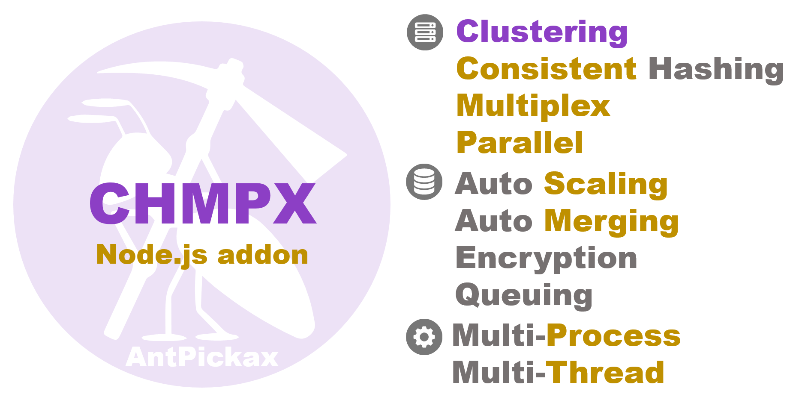

# **CHMPX Node.js**
**CHMPX Node.js** (addon library for Node.js) a Node.js addon library which wraps **CHMPX** (Consistent Hashing Mq inProcess data eXchange) as communication middleware.
Using **CHMPX Node.js**, all functions provided by the **CHMPX** library can be used from the server side JavaScript environment [Node.js](https://nodejs.org/).
**CHMPX Node.js** is one of [AntPickax](https://antpick.ax/)'s open source product by Yahoo! JAPAN.  

## {{ page.arrow_link_overview }}
[Overview](home.html) about **CHMPX Node.js** library.

## {{ page.arrow_link_feature }}
The explanation of the detailed [Feature](feature.html) of **CHMPX Node.js** library.

## {{ page.arrow_link_usage }}
How to [use](usage.html) **CHMPX Node.js** library for your program.

## {{ page.arrow_link_build }}
How to [build](build.html) **CHMPX Node.js** library from [source code]({{ site.github.repository_url }}) on Github.

## {{ page.arrow_link_developer }}
Detailed description of the programming interface provided by **CHMPX Node.js** library for [developer](developer.html)s.

## {{ page.arrow_link_environments }}
Description of [Environment](environments.html) variables used by **CHMPX Node.js** library to load.

# **About CHMPX**
[CHMPX](https://chmpx.antpick.ax/) (Consistent Hashing Mq inProcess data eXchange) is communication middleware with original featured function.
Please see the [CHMPX](https://chmpx.antpick.ax/) details page.

# **About AntPickax**
[AntPickax](https://antpick.ax/) is product group that is provided as open source by Yahoo! JAPAN.  
Please see the [AntPickax](https://antpick.ax/) details page.
